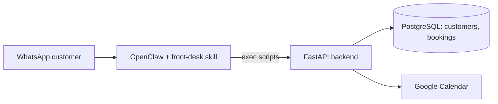

# agents42

An AI front-desk agent for appointment-based SMEs, built for the **NUS-ISS Show Me Your Agents
Hackathon 2026**. Customers message the business on WhatsApp; the agent identifies them, checks
real availability on the business's Google Calendar, and books the appointment - without
inventing prices, hours, or availability itself.


## First vertical slice

```text
WhatsApp customer
    -> OpenClaw (front-desk skill)
        -> resolve_customer.py    -> POST /customers/resolve
        -> search_availability.py -> POST /availability/search  -> Google Calendar free/busy
        -> create_booking.py      -> POST /bookings              -> Google Calendar event + DB row
```

The agent never computes availability or confirms a booking itself - it only relays what the
deterministic FastAPI backend returns. See [AGENTS42.md](AGENTS42.md) for the full agent
architecture and guardrails, and [DEVELOPMENT.md](DEVELOPMENT.md) for how to run and extend this.

## Architecture

- `app/src/agents42/` - the deterministic backend (FastAPI + PostgreSQL): customer lookup,
  business-rule-driven scheduling, and Google Calendar integration. No LLM involvement.
- `businesses/*.yaml` - one file per business (services, hours, timezone, calendar). Adding a
  new business is "add a YAML file", not "edit the core".
- `openclaw/workspace/skills/front-desk/` - the OpenClaw skill: `SKILL.md` (generic agent rules,
  business-agnostic) plus thin CLI scripts that call the FastAPI backend and print JSON, matching
  how OpenClaw actually invokes skills (`exec` a script, parse its JSON output).
- `migrations/` - plain SQL migrations, applied automatically on backend startup.



OpenClaw itself runs natively on the host (not in Docker) - see DEVELOPMENT.md for why.

## Setup

### Backend (Docker)

```bash
cp .env.example .env    # edit as needed
docker compose up -d --build
curl http://localhost:8090/health
```

### Backend (local, no Docker)

The venv lives under `app/`, but run commands from the **repo root** with `app/src` on
`PYTHONPATH` - `businesses/`, `migrations/`, and `credentials/` are all resolved relative to the
process's working directory, and they live at the repo root, not under `app/`.

```bash
python3 -m venv app/.venv && source app/.venv/bin/activate
pip install -e './app[dev]'
export PYTHONPATH=app/src
```

### Google Calendar

One-time local OAuth flow to generate a refresh token - see DEVELOPMENT.md "Google Calendar
setup" for the full walkthrough (Cloud Console project, OAuth client, calendar sharing). Run from
the repo root, with the venv above active:

```bash
python -m agents42.integrations.google_calendar_auth
```

### OpenClaw + WhatsApp

Run natively per the organiser's starter kit / our earlier `get_mooving` project - see
DEVELOPMENT.md "Running OpenClaw" for the installer and WhatsApp linking steps. Point it at
`openclaw/workspace/skills/front-desk/` and set `AGENTS42_API_BASE_URL` to the backend above.

## Running the tests

```bash
cd app
.venv/bin/pytest
```

All tests run against an in-memory SQLite database and a fake Calendar client - no real Postgres,
Google account, or LLM required. Scheduling math (`app/src/agents42/scheduling/service.py`) is
pure Python with no I/O, so it's exhaustively unit tested directly.

## Status

First vertical slice implemented: customer resolve/create, deterministic availability search
(2-hour grooming + 1-hour buffer), booking creation against a real Google Calendar with a
recheck-immediately-before-booking guard, and orphaned-Calendar-event rollback if the DB write
fails. Not yet built: rescheduling, cancellation, owner-facing commands, multi-staff/location
support - see AGENTS42.md "Not in this slice".

## Docs

- [AGENTS42.md](AGENTS42.md) - agent architecture, tool contract, guardrails, roadmap.
- [DEVELOPMENT.md](DEVELOPMENT.md) - local dev workflow, testing levels, AWS deployment, cautions.
- `docs/2026-09-05-agents42-proposal.md` - the official hackathon proposal.
- `docs/2026-08-27-sme-*.md` - pre-kickoff brainstorm/action-plan (historical context).
