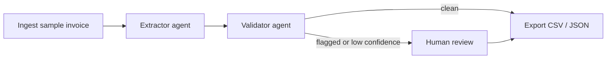

# agents42

A reusable agentic AI starter kit, built for the **NUS-ISS Show Me Your Agents Hackathon**
(Public Category, powered by AWS). The team's real SME problem statement is assigned at the
Hackathon Kickoff on Saturday, 5 September 2026; until then, this repo proves out the
architecture against a representative "Administrative Automation" example: an invoice/receipt
processing agent.



## Architecture

- `src/agents42/` — reusable, domain-agnostic core: LLM provider abstraction (AWS Bedrock,
  with an Anthropic-API fallback for local dev before hackathon AWS credits are issued),
  generic LangGraph node helpers (logging, retry, human-review interrupt), and a generic
  CSV/JSON export tool.
- `examples/invoice_processing/` — a concrete example built on that core: a multi-agent
  Supervisor -> Extractor -> Validator -> (optional human review) -> Export pipeline.
- `data/samples/` — hand-crafted sample invoices (plain text, standing in for OCR'd output),
  including deliberately anomalous ones (bad math, missing vendor, duplicate invoice number).

See `docs/superpowers/specs/2026-08-15-agents42-starter-kit-design.md` for the full design
rationale and `docs/superpowers/plans/2026-08-15-agents42-starter-kit-plan.md` for the
task-by-task implementation plan (not yet executed).

## Setup

```bash
python3 -m venv .venv
source .venv/bin/activate
pip install -e '.[dev]'
cp .env.example .env
```

Edit `.env` and set either:
- `LLM_PROVIDER=bedrock` with valid AWS credentials configured (via `aws configure` or
  environment variables) and `AWS_REGION` set to a region with Bedrock Claude access, or
- `LLM_PROVIDER=anthropic` with `ANTHROPIC_API_KEY` set, for local development before AWS
  hackathon credits are available.

## Running the tests

```bash
pytest
```

All tests mock the LLM — no API key or AWS credentials are required to run the test suite.

## Running the demo

CLI (processes every sample invoice, prints an agent trace, writes `data/output/invoices.{json,csv}`):

```bash
python -m examples.invoice_processing.run_cli
```

Streamlit UI (pick a sample, watch the agent trace step-by-step, approve/reject flagged
anomalies, download the export):

```bash
streamlit run examples/invoice_processing/app_streamlit.py
```

Both require a real `LLM_PROVIDER` configured in `.env` (unlike the test suite, which mocks
the LLM).

## Adapting this to the real SME problem (after the 5 Sep 2026 kickoff)

1. Create `examples/<new-problem>/` with its own `schema.py`, `agents.py`, `graph.py`,
   `prompts.py` — following the same shape as `examples/invoice_processing/`.
2. Reuse `agents42.llm.provider.get_llm()`, the node helpers in `agents42.graph.builder`, and
   `agents42.tools.export` as-is.
3. Point the Streamlit UI's data source and trace rendering at the new domain.

## Status

Design and implementation plan are complete and reviewed; code has not been written yet.
