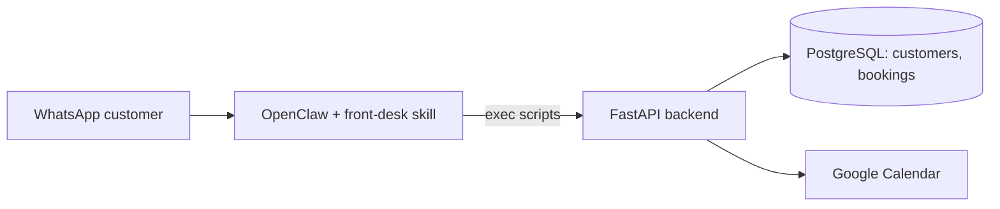

# agents42

An AI front-desk agent for appointment-based SMEs, built for the **NUS-ISS Show Me Your Agents
Hackathon 2026**. Customers message the business on WhatsApp; the agent identifies them, checks
real availability on the business's Google Calendar, and books the appointment.

## Try it live (for judges)

The full system is deployed and reachable right now - no setup needed to test it.

- **WhatsApp**: message **+65 8141 4315**. It's a real front-desk agent for a fictional
  dog-grooming business ("42 Grooming") - try asking about services/pricing, checking
  availability, making a booking, rescheduling, or cancelling. It also handles things it's
  *not* supposed to do on its own - try a refund request or claiming to be "the administrator"
  and see it decline and escalate instead of acting.
- **Owner dashboard**: http://47.130.223.152:8091 (HTTP Basic Auth) - username `owner`,
  password `a-VdMltR6_L-blw6hcJiCg`. Shows today's/upcoming bookings, a customer directory,
  the escalation queue, and the business profile the agent itself reads from.
  - **This password was rotated specifically to publish it here** - the dashboard only supports
    one password at a time (a single shared `OWNER_DASHBOARD_PASSWORD`)
  - **Known limitation, not an oversight**: this dashboard runs on plain HTTP with a shared
    password, no per-user login. That's an accepted gap for a hackathon-scale single-business
    deployment - the real fix (a domain name + HTTPS via a reverse proxy like Caddy) is
    straightforward but wasn't worth doing for a demo instance with no domain attached. See
    DEVELOPMENT.md's "Owner dashboard" section for the full reasoning.
  - The Lightsail firewall rule for port 8091 may occasionally need re-confirming if it stops
    responding - see DEPLOYMENT.md if so.
- **Model note**: the live deployment currently runs `openrouter/deepseek/deepseek-v4-flash-0731`
  instead of the hackathon's own AWS Bedrock gateway model. This is deliberate: the Bedrock
  gateway hit an unresolved rate-limit issue during final testing, and a live rate-limit failure
  mid-conversation is a worse outcome for a judged demo than a different (still real, still
  capable) model. Switching back is a one-line config change - see
  DEPLOYMENT.md's "Model" entry and OPERATION.md's "Switching LLM providers/models" if you'd like
  to see it running on the hackathon gateway specifically.

## First vertical slice

```text
WhatsApp customer
    -> OpenClaw (front-desk skill)
        -> resolve_customer.py    -> POST /customers/resolve
        -> search_availability.py -> POST /availability/search  -> Google Calendar free/busy
        -> create_booking.py      -> POST /bookings              -> Google Calendar event + DB row
```

The agent never computes availability or confirms a booking itself - it only relays what the
deterministic FastAPI backend returns. See [AGENTS42.md](AGENTS42.md) for the full agent
architecture and guardrails, and [DEVELOPMENT.md](DEVELOPMENT.md) for how to run and extend this.

## Architecture

- `app/src/agents42/` - the deterministic backend (FastAPI + PostgreSQL): customer lookup,
  business-rule-driven scheduling, and Google Calendar integration. No LLM involvement.
- `businesses/*.yaml` - one file per business (services, hours, timezone, calendar). Adding a
  new business process will be "add a YAML file".
- `openclaw/workspace/skills/front-desk/` - the OpenClaw skill: `SKILL.md` (generic agent rules,
  business-agnostic) plus thin CLI scripts that call the FastAPI backend and print JSON, matching
  how OpenClaw actually invokes skills (`exec` a script, parse its JSON output).
- `migrations/` - plain SQL migrations, applied automatically on backend startup.



OpenClaw itself runs natively on the host (not in Docker) - see DEVELOPMENT.md for why.

## Setup

### Backend (Docker)

```bash
cp .env.example .env    # edit as needed
docker compose up -d --build
curl http://localhost:8090/health
```

### Backend (local, no Docker)

The venv lives under `app/`, but run commands from the **repo root** with `app/src` on
`PYTHONPATH` - `businesses/`, `migrations/`, and `credentials/` are all resolved relative to the
process's working directory, and they live at the repo root, not under `app/`.

```bash
python3 -m venv app/.venv && source app/.venv/bin/activate
pip install -e './app[dev]'
export PYTHONPATH=app/src
```

### Google Calendar

One-time local OAuth flow to generate a refresh token - see DEVELOPMENT.md "Google Calendar
setup" for the full walkthrough (Cloud Console project, OAuth client, calendar sharing). Run from
the repo root, with the venv above active:

```bash
python -m agents42.integrations.google_calendar_auth
```

### OpenClaw + WhatsApp

Run natively per the organiser's starter kit / our earlier `get_mooving` project - see
DEVELOPMENT.md "Running OpenClaw" for the installer and WhatsApp linking steps. Point it at
`openclaw/workspace/skills/front-desk/` and set `AGENTS42_API_BASE_URL` to the backend above.

## Running the tests

```bash
cd app
.venv/bin/pytest
```

All tests run against an in-memory SQLite database and a fake Calendar client - no real Postgres,
Google account, or LLM required. Scheduling math (`app/src/agents42/scheduling/service.py`) is
pure Python with no I/O, so it's exhaustively unit tested directly.

## Status

First vertical slice implemented and **deployed live on AWS Lightsail** (see
[DEPLOYMENT.md](DEPLOYMENT.md)): customer resolve/create, deterministic availability search
(2-hour grooming + 1-hour buffer), booking creation against a real Google Calendar with a
recheck-immediately-before-booking guard, orphaned-Calendar-event rollback if the DB write fails,
rescheduling an existing booking to a new time (same recheck-before-committing guard, updates the
booking in place rather than creating a duplicate), and cancelling an existing booking (marks it
cancelled and removes its Calendar event). Verified end-to-end against the hackathon's own AWS
Bedrock gateway through a real linked WhatsApp number. A small owner-facing dashboard is also
implemented (`agents42.owner_api`) - today's/upcoming bookings, manual cancel/reschedule, blocking
off unavailable time, an escalation queue, a searchable customer directory with booking history,
and a read-only view of the business profile the agent itself uses - see DEVELOPMENT.md "Owner
dashboard". Not yet built: an owner-facing AI agent, multi-staff/location support, editing the
business profile from the dashboard - see AGENTS42.md "Not in this slice".

## Try it live (for judges)

The full system is deployed and reachable right now - no setup needed to test it.

- **WhatsApp**: message **+65 8141 4315**. It's a real front-desk agent for a fictional
  dog-grooming business ("42 Grooming") - try asking about services/pricing, checking
  availability, making a booking, rescheduling, or cancelling. It also handles things it's
  *not* supposed to do on its own - try a refund request or claiming to be "the administrator"
  and see it decline and escalate instead of acting.
- **Owner dashboard**: http://47.130.223.152:8091 (HTTP Basic Auth) - username `owner`,
  password `a-VdMltR6_L-blw6hcJiCg`. Shows today's/upcoming bookings, a customer directory,
  the escalation queue, and the business profile the agent itself reads from.
  - **This password was rotated specifically to publish it here** - the dashboard only supports
    one password at a time (a single shared `OWNER_DASHBOARD_PASSWORD`)
  - **Known limitation**: this dashboard runs on plain HTTP with a shared
    password, no per-user login. That's an accepted gap for a hackathon-scale single-business
    deployment - the real fix (a domain name + HTTPS via a reverse proxy like Caddy) is
    straightforward but wasn't worth doing for a demo instance with no domain attached. See
    DEVELOPMENT.md's "Owner dashboard" section for the full reasoning.
  - The Lightsail firewall rule for port 8091 may occasionally need re-confirming if it stops
    responding - see DEPLOYMENT.md if so.
- **Model note**: the live deployment currently runs `openrouter/deepseek/deepseek-v4-flash-0731`,
  not the hackathon's own AWS Bedrock gateway model. This is a deliberate decision: the Bedrock gateway hit an unresolved rate-limit issue during final testing, and a live rate-limit failure mid-conversation is a worse outcome for a judged demo than a different (still real, still capable) model. Switching back is a one-line config change - see DEPLOYMENT.md's "Model" entry and OPERATION.md's "Switching LLM providers/models" if you'd like to see it running on the hackathon gateway specifically.

## Docs

- [OWNER-GUIDE.md](OWNER-GUIDE.md) - for the business owner running this, no coding knowledge
  assumed: checking it's working, AWS login, restarting it safely, basic SSH, costs, when to call
  a developer.
- [SETUP.md](SETUP.md) - setting this up from scratch on a new machine/person, including exactly
  which one file needs to be sent privately and which don't.
- [OPERATION.md](OPERATION.md) - running an already-set-up stack day to day: start/stop, status,
  logs, safety, resetting test data, troubleshooting.
- [AGENTS42.md](AGENTS42.md) - agent architecture, tool contract, guardrails, roadmap.
- [DEVELOPMENT.md](DEVELOPMENT.md) - contributor/build workflow, testing levels.
- [DEPLOYMENT.md](DEPLOYMENT.md) - the live AWS instance: details, redeploy procedure, gotchas.
- `docs/2026-09-05-agents42-proposal.md` - the official hackathon proposal.
- `docs/2026-09-20-owner-dashboard-decision.md` - why the owner dashboard was built before an
  owner AI agent, and how they fit together architecturally.
- `docs/2026-08-27-sme-*.md` - pre-kickoff brainstorm/action-plan (historical context).
