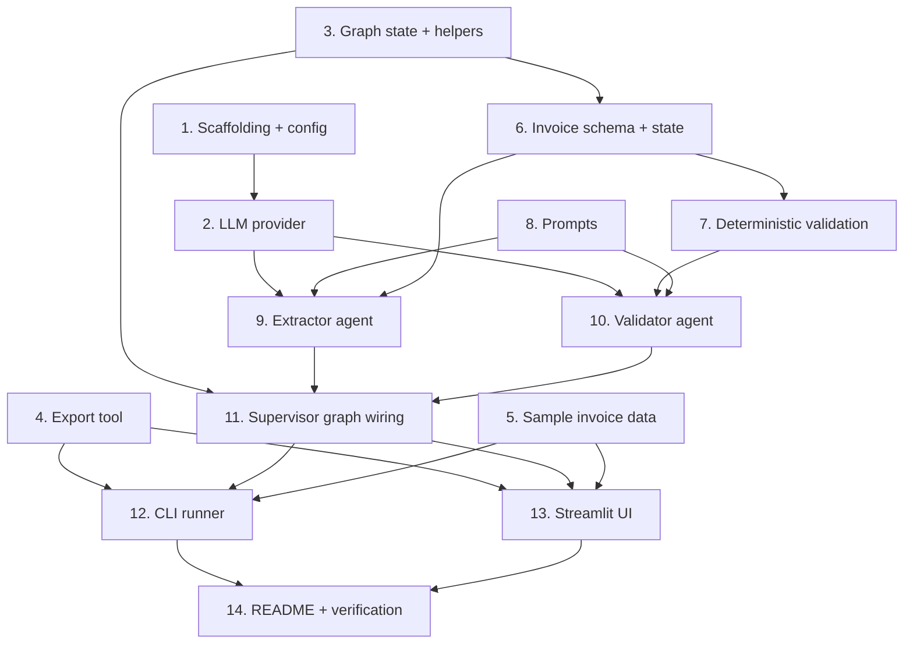

# agents42 Starter Kit + Invoice Processing Example Implementation Plan

> **For agentic workers:** REQUIRED SUB-SKILL: Use superpowers:subagent-driven-development (recommended) or superpowers:executing-plans to implement this plan task-by-task. Steps use checkbox (`- [ ]`) syntax for tracking.

**Goal:** Build a reusable, domain-agnostic agentic AI starter kit (LLM provider abstraction, LangGraph helpers, export tooling) and prove it out with a working invoice/receipt processing agent example, for the NUS-ISS Show Me Your Agents Hackathon (Public Category).

**Architecture:** A `src/agents42` core package (LLM provider abstraction, generic LangGraph state/graph helpers, generic export tool) consumed by an `examples/invoice_processing` app implementing a multi-agent Supervisor pattern (Extractor agent -> Validator agent -> conditional human-review interrupt -> export), runnable via both a CLI and a Streamlit demo UI, against 6 hand-crafted sample invoices.

**Tech Stack:** Python (>=3.11), LangGraph (multi-agent orchestration + human-in-the-loop interrupts), LangChain core + `langchain-aws` (Bedrock) + `langchain-anthropic` (fallback), Pydantic v2 + pydantic-settings, Streamlit (demo UI), pytest (tests, with mocked LLM calls throughout).

**Spec:** `docs/superpowers/specs/2026-08-15-agents42-starter-kit-design.md`

## Global Constraints

- Python `>=3.11` per `pyproject.toml`. The local dev machine has Python 3.14 installed; if `pip install -e '.[dev]'` fails because a dependency doesn't yet support 3.14, switch to a 3.11-3.12 virtualenv instead of downgrading the dependency version floors below what's needed for the APIs this plan uses (`interrupt`/`Command` human-in-the-loop, `with_structured_output`).
- `src/` layout: only `agents42` is an installable package (`pyproject.toml` `[tool.setuptools.packages.find] where = ["src"]`). `examples/`, `data/`, and `tests/` are accessed via the repo root being on `sys.path` (`[tool.pytest.ini_options] pythonpath = ["src", "."]`), not installed as packages.
- Every new `.py` file starts with `from __future__ import annotations`.
- All LLM calls in agent code go through `agents42.llm.provider.get_llm()` — never construct `ChatBedrockConverse`/`ChatAnthropic` directly anywhere else. This is what keeps provider-swapping and test-mocking centralized.
- No test may make a real network/LLM call. Every test that exercises a node calls `unittest.mock.patch` on `get_llm` **at the importing module's name** (e.g. `patch("examples.invoice_processing.agents.get_llm", ...)`), not on `agents42.llm.provider.get_llm` directly — this is standard Python mocking practice (patch where a name is looked up, not where it's defined) and matters here because every agent module does `from agents42.llm.provider import get_llm`.
- Run the full test suite (`pytest`) before each commit; every task ends green.
- Commit after each task with a `feat:`/`test:` prefixed message, per the steps below.

## Task Build Order



Tasks 1, 3, 4, 5, and 8 have no dependencies on each other and can be built in any order (or
in parallel by separate subagents); everything else follows the edges above.

---

### Task 1: Project scaffolding + config loader

**Files:**
- Create: `pyproject.toml`
- Create: `.env.example`
- Create: `src/agents42/__init__.py`
- Create: `src/agents42/config.py`
- Create: `tests/test_config.py`
- Modify: `.gitignore` (append a Python section)

**Interfaces:**
- Consumes: nothing (first task)
- Produces: `agents42.config.Settings` (pydantic-settings `BaseSettings`) with fields `llm_provider: str`, `bedrock_model_id: str`, `aws_region: str`, `anthropic_model: str`, `anthropic_api_key: str | None`, `llm_temperature: float`, and `agents42.config.get_settings() -> Settings`.

- [ ] **Step 1: Create project scaffolding**

`pyproject.toml`:

```toml
[project]
name = "agents42"
version = "0.1.0"
description = "Reusable agentic AI starter kit + invoice processing example for the NUS-ISS Show Me Your Agents Hackathon"
requires-python = ">=3.11"
dependencies = [
    "langgraph>=0.2.60",
    "langchain-core>=0.3.25",
    "langchain-aws>=0.2.10",
    "langchain-anthropic>=0.3.0",
    "pydantic>=2.9",
    "pydantic-settings>=2.6",
    "streamlit>=1.40",
]

[project.optional-dependencies]
dev = [
    "pytest>=8.3",
]

[build-system]
requires = ["setuptools>=68"]
build-backend = "setuptools.build_meta"

[tool.setuptools.packages.find]
where = ["src"]

[tool.pytest.ini_options]
pythonpath = ["src", "."]
testpaths = ["tests"]
```

`.env.example`:

```
LLM_PROVIDER=bedrock
BEDROCK_MODEL_ID=anthropic.claude-3-5-sonnet-20241022-v2:0
AWS_REGION=us-east-1
ANTHROPIC_MODEL=claude-3-5-sonnet-20241022
ANTHROPIC_API_KEY=
LLM_TEMPERATURE=0.0
```

Append to `.gitignore`:

```

# Python
__pycache__/
*.pyc
.venv/
*.egg-info/
.pytest_cache/

# Environment
.env

# Generated demo output
data/output/
```

`src/agents42/__init__.py`:

```python
from __future__ import annotations

__version__ = "0.1.0"
```

Then install the project in editable mode:

Run: `pip install -e '.[dev]'`
Expected: installs successfully (see Global Constraints if it fails on Python 3.14).

- [ ] **Step 2: Write the failing test**

`tests/test_config.py`:

```python
from __future__ import annotations

from agents42.config import Settings


def test_defaults(monkeypatch):
    monkeypatch.delenv("LLM_PROVIDER", raising=False)
    settings = Settings(_env_file=None)
    assert settings.llm_provider == "bedrock"
    assert settings.aws_region == "us-east-1"
    assert settings.llm_temperature == 0.0


def test_env_override(monkeypatch):
    monkeypatch.setenv("LLM_PROVIDER", "anthropic")
    monkeypatch.setenv("ANTHROPIC_API_KEY", "test-key")
    settings = Settings(_env_file=None)
    assert settings.llm_provider == "anthropic"
    assert settings.anthropic_api_key == "test-key"
```

- [ ] **Step 3: Run test to verify it fails**

Run: `pytest tests/test_config.py -v`
Expected: FAIL with `ModuleNotFoundError: No module named 'agents42.config'`

- [ ] **Step 4: Write minimal implementation**

`src/agents42/config.py`:

```python
from __future__ import annotations

from pydantic import Field
from pydantic_settings import BaseSettings, SettingsConfigDict


class Settings(BaseSettings):
    model_config = SettingsConfigDict(env_file=".env", env_file_encoding="utf-8", extra="ignore")

    llm_provider: str = Field(default="bedrock", alias="LLM_PROVIDER")
    bedrock_model_id: str = Field(
        default="anthropic.claude-3-5-sonnet-20241022-v2:0", alias="BEDROCK_MODEL_ID"
    )
    aws_region: str = Field(default="us-east-1", alias="AWS_REGION")
    anthropic_model: str = Field(default="claude-3-5-sonnet-20241022", alias="ANTHROPIC_MODEL")
    anthropic_api_key: str | None = Field(default=None, alias="ANTHROPIC_API_KEY")
    llm_temperature: float = Field(default=0.0, alias="LLM_TEMPERATURE")


def get_settings() -> Settings:
    return Settings()
```

- [ ] **Step 5: Run test to verify it passes**

Run: `pytest tests/test_config.py -v`
Expected: PASS (2 passed)

- [ ] **Step 6: Commit**

```bash
git add pyproject.toml .env.example .gitignore src/agents42/__init__.py src/agents42/config.py tests/test_config.py
git commit -m "feat: scaffold agents42 package and config loader"
```

---

### Task 2: LLM provider abstraction

**Files:**
- Create: `src/agents42/llm/__init__.py`
- Create: `src/agents42/llm/provider.py`
- Create: `tests/test_llm_provider.py`

**Interfaces:**
- Consumes: `agents42.config.Settings`, `agents42.config.get_settings()` (Task 1)
- Produces: `agents42.llm.provider.build_llm(settings: Settings) -> BaseChatModel`, `agents42.llm.provider.get_llm() -> BaseChatModel` (cached singleton, provider selected via `Settings.llm_provider`)

- [ ] **Step 1: Write the failing test**

`src/agents42/llm/__init__.py`:

```python
from __future__ import annotations
```

`tests/test_llm_provider.py`:

```python
from __future__ import annotations

from unittest.mock import MagicMock, patch

import pytest

from agents42.config import Settings
from agents42.llm.provider import build_llm


def test_build_llm_bedrock():
    settings = Settings(
        _env_file=None, LLM_PROVIDER="bedrock", BEDROCK_MODEL_ID="test-model", AWS_REGION="us-west-2"
    )
    with patch("langchain_aws.ChatBedrockConverse") as mock_cls:
        mock_cls.return_value = MagicMock()
        build_llm(settings)
    mock_cls.assert_called_once_with(model="test-model", region_name="us-west-2", temperature=0.0)


def test_build_llm_anthropic():
    settings = Settings(
        _env_file=None, LLM_PROVIDER="anthropic", ANTHROPIC_API_KEY="key123", ANTHROPIC_MODEL="test-model"
    )
    with patch("langchain_anthropic.ChatAnthropic") as mock_cls:
        mock_cls.return_value = MagicMock()
        build_llm(settings)
    mock_cls.assert_called_once_with(model="test-model", api_key="key123", temperature=0.0)


def test_build_llm_anthropic_missing_key():
    settings = Settings(_env_file=None, LLM_PROVIDER="anthropic", ANTHROPIC_API_KEY=None)
    with pytest.raises(ValueError, match="ANTHROPIC_API_KEY"):
        build_llm(settings)


def test_build_llm_unknown_provider():
    settings = Settings(_env_file=None, LLM_PROVIDER="bogus")
    with pytest.raises(ValueError, match="Unknown LLM_PROVIDER"):
        build_llm(settings)
```

- [ ] **Step 2: Run test to verify it fails**

Run: `pytest tests/test_llm_provider.py -v`
Expected: FAIL with `ModuleNotFoundError: No module named 'agents42.llm.provider'`

- [ ] **Step 3: Write minimal implementation**

`src/agents42/llm/provider.py`:

```python
from __future__ import annotations

from functools import lru_cache

from langchain_core.language_models import BaseChatModel

from agents42.config import Settings, get_settings


def build_llm(settings: Settings) -> BaseChatModel:
    if settings.llm_provider == "bedrock":
        from langchain_aws import ChatBedrockConverse

        return ChatBedrockConverse(
            model=settings.bedrock_model_id,
            region_name=settings.aws_region,
            temperature=settings.llm_temperature,
        )
    if settings.llm_provider == "anthropic":
        from langchain_anthropic import ChatAnthropic

        if not settings.anthropic_api_key:
            raise ValueError("ANTHROPIC_API_KEY is required when LLM_PROVIDER=anthropic")
        return ChatAnthropic(
            model=settings.anthropic_model,
            api_key=settings.anthropic_api_key,
            temperature=settings.llm_temperature,
        )
    raise ValueError(f"Unknown LLM_PROVIDER: {settings.llm_provider!r}")


@lru_cache(maxsize=1)
def get_llm() -> BaseChatModel:
    return build_llm(get_settings())
```

- [ ] **Step 4: Run test to verify it passes**

Run: `pytest tests/test_llm_provider.py -v`
Expected: PASS (4 passed)

- [ ] **Step 5: Commit**

```bash
git add src/agents42/llm/__init__.py src/agents42/llm/provider.py tests/test_llm_provider.py
git commit -m "feat: add LLM provider abstraction (Bedrock + Anthropic fallback)"
```

---

### Task 3: Reusable graph state + LangGraph helpers

**Files:**
- Create: `src/agents42/graph/__init__.py`
- Create: `src/agents42/graph/state.py`
- Create: `src/agents42/graph/builder.py`
- Create: `tests/test_graph_builder.py`

**Interfaces:**
- Consumes: nothing new (stdlib + `langgraph`)
- Produces:
  - `agents42.graph.state.TraceEntry` (`TypedDict`: `agent: str`, `action: str`, `output: str`)
  - `agents42.graph.state.BaseAgentState` (`TypedDict`: `trace: Annotated[list[TraceEntry], operator.add]`)
  - `agents42.graph.state.log_entry(agent: str, action: str, output: str) -> TraceEntry`
  - `agents42.graph.builder.with_logging(agent_name: str, action: str, node: Callable) -> Callable` — wraps a node; if the node's return dict includes `_log_summary`, it's popped and used as the trace entry's `output`.
  - `agents42.graph.builder.with_retry(node: Callable, max_attempts: int = 2) -> Callable`
  - `agents42.graph.builder.human_review_node(state) -> dict` — calls `langgraph.types.interrupt(...)`, returns `{"human_decision": ..., "trace": [...]}`

- [ ] **Step 1: Write the failing test**

`src/agents42/graph/__init__.py`:

```python
from __future__ import annotations
```

`tests/test_graph_builder.py`:

```python
from __future__ import annotations

import pytest
from langgraph.checkpoint.memory import MemorySaver
from langgraph.graph import END, START, StateGraph
from langgraph.types import Command

from agents42.graph.builder import human_review_node, with_logging, with_retry
from agents42.graph.state import BaseAgentState


def test_with_logging_appends_trace():
    def node(state):
        return {"value": 42, "_log_summary": "computed value"}

    wrapped = with_logging("tester", "compute", node)
    result = wrapped({"trace": []})
    assert result["value"] == 42
    assert result["trace"] == [{"agent": "tester", "action": "compute", "output": "computed value"}]


def test_with_retry_succeeds_after_failure():
    calls = {"count": 0}

    def flaky(state):
        calls["count"] += 1
        if calls["count"] < 2:
            raise RuntimeError("boom")
        return {"ok": True}

    wrapped = with_retry(flaky, max_attempts=3)
    result = wrapped({})
    assert result == {"ok": True}
    assert calls["count"] == 2


def test_with_retry_raises_after_exhausting_attempts():
    def always_fails(state):
        raise RuntimeError("boom")

    wrapped = with_retry(always_fails, max_attempts=2)
    with pytest.raises(RuntimeError, match="failed after 2 attempts"):
        wrapped({})


def test_human_review_node_pauses_and_resumes():
    graph = StateGraph(BaseAgentState)
    graph.add_node("review", human_review_node)
    graph.add_edge(START, "review")
    graph.add_edge("review", END)
    app = graph.compile(checkpointer=MemorySaver())
    config = {"configurable": {"thread_id": "test-thread"}}

    result = app.invoke({"trace": []}, config=config)
    assert "__interrupt__" in result

    resumed = app.invoke(Command(resume="approved"), config=config)
    assert resumed["human_decision"] == "approved"
```

- [ ] **Step 2: Run test to verify it fails**

Run: `pytest tests/test_graph_builder.py -v`
Expected: FAIL with `ModuleNotFoundError: No module named 'agents42.graph.builder'`

- [ ] **Step 3: Write minimal implementation**

`src/agents42/graph/state.py`:

```python
from __future__ import annotations

import operator
from typing import Annotated, TypedDict


class TraceEntry(TypedDict):
    agent: str
    action: str
    output: str


class BaseAgentState(TypedDict):
    trace: Annotated[list[TraceEntry], operator.add]


def log_entry(agent: str, action: str, output: str) -> TraceEntry:
    return {"agent": agent, "action": action, "output": output}
```

`src/agents42/graph/builder.py`:

```python
from __future__ import annotations

from collections.abc import Callable
from typing import Any

from langgraph.types import interrupt

from agents42.graph.state import log_entry


def with_logging(
    agent_name: str, action: str, node: Callable[[Any], dict[str, Any]]
) -> Callable[[Any], dict[str, Any]]:
    def wrapped(state: Any) -> dict[str, Any]:
        result = node(state)
        output_summary = result.pop("_log_summary", "done")
        result["trace"] = [log_entry(agent_name, action, output_summary)]
        return result

    return wrapped


def with_retry(
    node: Callable[[Any], dict[str, Any]], max_attempts: int = 2
) -> Callable[[Any], dict[str, Any]]:
    def wrapped(state: Any) -> dict[str, Any]:
        last_error: Exception | None = None
        for _ in range(max_attempts):
            try:
                return node(state)
            except Exception as exc:  # noqa: BLE001 - deliberately broad, retried
                last_error = exc
        raise RuntimeError(f"node failed after {max_attempts} attempts") from last_error

    return wrapped


def human_review_node(state: Any) -> dict[str, Any]:
    decision = interrupt(
        {
            "reason": "validation flagged this record for human review",
            "flags": (state.get("validation") or {}).get("flags", []),
            "record": state.get("extraction"),
        }
    )
    return {
        "human_decision": decision,
        "trace": [log_entry("human_review", "reviewed", str(decision))],
    }
```

- [ ] **Step 4: Run test to verify it passes**

Run: `pytest tests/test_graph_builder.py -v`
Expected: PASS (4 passed)

- [ ] **Step 5: Commit**

```bash
git add src/agents42/graph/__init__.py src/agents42/graph/state.py src/agents42/graph/builder.py tests/test_graph_builder.py
git commit -m "feat: add reusable LangGraph state and node helpers (logging, retry, human-review interrupt)"
```

---

### Task 4: Generic export tool

**Files:**
- Create: `src/agents42/tools/__init__.py`
- Create: `src/agents42/tools/export.py`
- Create: `tests/test_export.py`

**Interfaces:**
- Consumes: nothing new (stdlib + `pydantic.BaseModel`)
- Produces: `agents42.tools.export.export_records(records: list[BaseModel], out_dir: Path, basename: str) -> dict[str, Path]` (keys `"json"`, `"csv"`)

- [ ] **Step 1: Write the failing test**

`tests/test_export.py`:

```python
from __future__ import annotations

import json
from pathlib import Path

from pydantic import BaseModel

from agents42.tools.export import export_records


class Dummy(BaseModel):
    name: str
    amount: float


def test_export_records_json_and_csv(tmp_path: Path):
    records = [Dummy(name="a", amount=1.5), Dummy(name="b", amount=2.5)]
    paths = export_records(records, tmp_path, "dummy")

    assert paths["json"].exists()
    assert paths["csv"].exists()

    data = json.loads(paths["json"].read_text())
    assert data == [{"name": "a", "amount": 1.5}, {"name": "b", "amount": 2.5}]

    csv_text = paths["csv"].read_text()
    assert "name,amount" in csv_text
    assert "a,1.5" in csv_text


def test_export_records_empty_list(tmp_path: Path):
    paths = export_records([], tmp_path, "empty")
    assert paths["json"].read_text() == "[]"
    assert paths["csv"].read_text() == ""
```

- [ ] **Step 2: Run test to verify it fails**

Run: `pytest tests/test_export.py -v`
Expected: FAIL with `ModuleNotFoundError: No module named 'agents42.tools.export'`

- [ ] **Step 3: Write minimal implementation**

`src/agents42/tools/__init__.py`:

```python
from __future__ import annotations
```

`src/agents42/tools/export.py`:

```python
from __future__ import annotations

import csv
import json
from pathlib import Path
from typing import Any

from pydantic import BaseModel


def export_records(records: list[BaseModel], out_dir: Path, basename: str) -> dict[str, Path]:
    out_dir.mkdir(parents=True, exist_ok=True)
    rows = [record.model_dump(mode="json") for record in records]

    json_path = out_dir / f"{basename}.json"
    json_path.write_text(json.dumps(rows, indent=2), encoding="utf-8")

    csv_path = out_dir / f"{basename}.csv"
    if rows:
        fieldnames = list(_flatten(rows[0]).keys())
        with csv_path.open("w", newline="", encoding="utf-8") as fh:
            writer = csv.DictWriter(fh, fieldnames=fieldnames)
            writer.writeheader()
            for row in rows:
                writer.writerow(_flatten(row))
    else:
        csv_path.write_text("", encoding="utf-8")

    return {"json": json_path, "csv": csv_path}


def _flatten(row: dict[str, Any], prefix: str = "") -> dict[str, Any]:
    flat: dict[str, Any] = {}
    for key, value in row.items():
        full_key = f"{prefix}{key}"
        if isinstance(value, dict):
            flat.update(_flatten(value, prefix=f"{full_key}."))
        elif isinstance(value, list):
            flat[full_key] = json.dumps(value)
        else:
            flat[full_key] = value
    return flat
```

- [ ] **Step 4: Run test to verify it passes**

Run: `pytest tests/test_export.py -v`
Expected: PASS (2 passed)

- [ ] **Step 5: Commit**

```bash
git add src/agents42/tools/__init__.py src/agents42/tools/export.py tests/test_export.py
git commit -m "feat: add generic structured-record CSV/JSON export tool"
```

---

### Task 5: Sample invoice data

**Files:**
- Create: `data/samples/invoice_clean_1.txt`
- Create: `data/samples/invoice_clean_2.txt`
- Create: `data/samples/invoice_bad_math.txt`
- Create: `data/samples/invoice_missing_vendor.txt`
- Create: `data/samples/invoice_duplicate_a.txt`
- Create: `data/samples/invoice_duplicate_b.txt`
- Create: `tests/test_samples.py`

**Interfaces:**
- Consumes: nothing
- Produces: 6 fixed-name sample files under `data/samples/`, referenced by filename in later tasks (CLI, Streamlit UI).

- [ ] **Step 1: Write the failing test**

`tests/test_samples.py`:

```python
from __future__ import annotations

from pathlib import Path

SAMPLES_DIR = Path(__file__).resolve().parents[1] / "data" / "samples"

EXPECTED_SAMPLES = {
    "invoice_clean_1.txt",
    "invoice_clean_2.txt",
    "invoice_bad_math.txt",
    "invoice_missing_vendor.txt",
    "invoice_duplicate_a.txt",
    "invoice_duplicate_b.txt",
}


def test_sample_invoices_exist_and_nonempty():
    found = {p.name for p in SAMPLES_DIR.glob("*.txt")}
    assert found == EXPECTED_SAMPLES
    for name in EXPECTED_SAMPLES:
        content = (SAMPLES_DIR / name).read_text(encoding="utf-8")
        assert content.strip(), f"{name} should not be empty"
        assert "Invoice Number:" in content
```

- [ ] **Step 2: Run test to verify it fails**

Run: `pytest tests/test_samples.py -v`
Expected: FAIL — `AssertionError` (found set is empty, doesn't match `EXPECTED_SAMPLES`)

- [ ] **Step 3: Create the sample files**

`data/samples/invoice_clean_1.txt`:

```
INVOICE
Invoice Number: INV-1001
Vendor: Golden Leaf Trading Pte Ltd
Date: 2026-07-02

Line Items:
1. Office chairs x 4 @ 120.00 = 480.00
2. Standing desks x 2 @ 350.00 = 700.00

Subtotal: 1180.00
Tax (9%): 106.20
Total: 1286.20
```

`data/samples/invoice_clean_2.txt`:

```
INVOICE
Invoice Number: INV-1002
Vendor: Bright Print Solutions
Date: 2026-07-05

Line Items:
1. A4 paper (box of 5 reams) x 10 @ 18.50 = 185.00
2. Toner cartridge x 3 @ 65.00 = 195.00

Subtotal: 380.00
Tax (9%): 34.20
Total: 414.20
```

`data/samples/invoice_bad_math.txt`:

```
INVOICE
Invoice Number: INV-1003
Vendor: Harbourfront Logistics
Date: 2026-07-08

Line Items:
1. Pallet delivery x 6 @ 45.00 = 270.00
2. Warehouse storage (1 month) x 1 @ 300.00 = 300.00

Subtotal: 570.00
Tax (9%): 51.30
Total: 700.00
```

`data/samples/invoice_missing_vendor.txt`:

```
INVOICE
Invoice Number: INV-1004
Vendor:
Date: 2026-07-10

Line Items:
1. Cleaning service (monthly) x 1 @ 250.00 = 250.00

Subtotal: 250.00
Tax (9%): 22.50
Total: 272.50
```

`data/samples/invoice_duplicate_a.txt`:

```
INVOICE
Invoice Number: INV-1005
Vendor: Sunrise Catering
Date: 2026-07-12

Line Items:
1. Lunch catering (20 pax) x 1 @ 400.00 = 400.00

Subtotal: 400.00
Tax (9%): 36.00
Total: 436.00
```

`data/samples/invoice_duplicate_b.txt`:

```
INVOICE
Invoice Number: INV-1005
Vendor: Sunrise Catering
Date: 2026-08-02

Line Items:
1. Lunch catering (20 pax) x 1 @ 400.00 = 400.00

Subtotal: 400.00
Tax (9%): 36.00
Total: 436.00
```

- [ ] **Step 4: Run test to verify it passes**

Run: `pytest tests/test_samples.py -v`
Expected: PASS (1 passed)

- [ ] **Step 5: Commit**

```bash
git add data/samples tests/test_samples.py
git commit -m "feat: add sample invoice fixtures (clean, bad-math, missing-vendor, duplicate)"
```

---

### Task 6: Invoice domain schema + LangGraph state

**Files:**
- Create: `examples/__init__.py`
- Create: `examples/invoice_processing/__init__.py`
- Create: `examples/invoice_processing/schema.py`
- Create: `examples/invoice_processing/state.py`
- Create: `tests/test_schema.py`

**Interfaces:**
- Consumes: `agents42.graph.state.BaseAgentState` (Task 3)
- Produces:
  - `examples.invoice_processing.schema.LineItem` (Pydantic: `description: str`, `quantity: float`, `unit_price: float`, `line_total: float`)
  - `examples.invoice_processing.schema.ExtractedInvoice` (Pydantic: `invoice_number: str = ""`, `vendor: str = ""`, `date: str = ""`, `line_items: list[LineItem] = []`, `subtotal: float = 0.0`, `tax: float = 0.0`, `total: float = 0.0`) — fields default to empty/zero rather than raising, because business-rule flagging (e.g. "vendor missing") is the Validator's job (Task 7), not schema validation's.
  - `examples.invoice_processing.schema.ValidationResult` (Pydantic: `flags: list[str] = []`, `confidence: float = 1.0`, property `needs_review: bool`)
  - `examples.invoice_processing.state.InvoiceState` (`TypedDict(BaseAgentState)`: `raw_text: str`, `extraction: dict | None`, `validation: dict | None`, `human_decision: str | None`, `seen_invoice_numbers: list[str]`)

- [ ] **Step 1: Write the failing test**

`examples/__init__.py`:

```python
from __future__ import annotations
```

`examples/invoice_processing/__init__.py`:

```python
from __future__ import annotations
```

`tests/test_schema.py`:

```python
from __future__ import annotations

from examples.invoice_processing.schema import ExtractedInvoice, LineItem, ValidationResult


def _line_item(**overrides):
    defaults = {"description": "Widget", "quantity": 1, "unit_price": 10.0, "line_total": 10.0}
    defaults.update(overrides)
    return LineItem(**defaults)


def test_extracted_invoice_valid():
    invoice = ExtractedInvoice(
        invoice_number="INV-1",
        vendor="Acme",
        date="2026-01-01",
        line_items=[_line_item()],
        subtotal=10.0,
        tax=0.9,
        total=10.9,
    )
    assert invoice.vendor == "Acme"
    assert invoice.line_items[0].line_total == 10.0


def test_extracted_invoice_defaults_allow_missing_fields():
    invoice = ExtractedInvoice(invoice_number="INV-2")
    assert invoice.vendor == ""
    assert invoice.line_items == []


def test_validation_result_needs_review_on_flags():
    assert ValidationResult(flags=["bad math"], confidence=1.0).needs_review is True


def test_validation_result_needs_review_on_low_confidence():
    assert ValidationResult(flags=[], confidence=0.5).needs_review is True


def test_validation_result_no_review_when_clean():
    assert ValidationResult(flags=[], confidence=0.95).needs_review is False
```

- [ ] **Step 2: Run test to verify it fails**

Run: `pytest tests/test_schema.py -v`
Expected: FAIL with `ModuleNotFoundError: No module named 'examples.invoice_processing.schema'`

- [ ] **Step 3: Write minimal implementation**

`examples/invoice_processing/schema.py`:

```python
from __future__ import annotations

from pydantic import BaseModel, Field


class LineItem(BaseModel):
    description: str
    quantity: float
    unit_price: float
    line_total: float


class ExtractedInvoice(BaseModel):
    invoice_number: str = ""
    vendor: str = ""
    date: str = ""
    line_items: list[LineItem] = Field(default_factory=list)
    subtotal: float = 0.0
    tax: float = 0.0
    total: float = 0.0


class ValidationResult(BaseModel):
    flags: list[str] = Field(default_factory=list)
    confidence: float = 1.0

    @property
    def needs_review(self) -> bool:
        return bool(self.flags) or self.confidence < 0.8
```

`examples/invoice_processing/state.py`:

```python
from __future__ import annotations

from agents42.graph.state import BaseAgentState


class InvoiceState(BaseAgentState):
    raw_text: str
    extraction: dict | None
    validation: dict | None
    human_decision: str | None
    seen_invoice_numbers: list[str]
```

- [ ] **Step 4: Run test to verify it passes**

Run: `pytest tests/test_schema.py -v`
Expected: PASS (5 passed)

- [ ] **Step 5: Commit**

```bash
git add examples/__init__.py examples/invoice_processing/__init__.py examples/invoice_processing/schema.py examples/invoice_processing/state.py tests/test_schema.py
git commit -m "feat: add invoice domain schema and LangGraph state shape"
```

---

### Task 7: Deterministic validation rules

**Files:**
- Create: `examples/invoice_processing/validation.py`
- Create: `tests/test_validation.py`

**Interfaces:**
- Consumes: `examples.invoice_processing.schema.ExtractedInvoice` (Task 6)
- Produces:
  - `check_math_consistency(invoice: ExtractedInvoice) -> list[str]`
  - `check_required_fields(invoice: ExtractedInvoice) -> list[str]`
  - `check_duplicate_invoice_number(invoice: ExtractedInvoice, seen_numbers: set[str]) -> list[str]`
  - `run_deterministic_checks(invoice: ExtractedInvoice, seen_numbers: set[str]) -> list[str]`

- [ ] **Step 1: Write the failing test**

`tests/test_validation.py`:

```python
from __future__ import annotations

from examples.invoice_processing.schema import ExtractedInvoice, LineItem
from examples.invoice_processing.validation import (
    check_duplicate_invoice_number,
    check_math_consistency,
    check_required_fields,
    run_deterministic_checks,
)


def _clean_invoice(invoice_number: str = "INV-1") -> ExtractedInvoice:
    return ExtractedInvoice(
        invoice_number=invoice_number,
        vendor="Acme",
        date="2026-01-01",
        line_items=[LineItem(description="Widget", quantity=2, unit_price=5.0, line_total=10.0)],
        subtotal=10.0,
        tax=0.9,
        total=10.9,
    )


def test_check_math_consistency_clean_invoice_has_no_flags():
    assert check_math_consistency(_clean_invoice()) == []


def test_check_math_consistency_flags_bad_subtotal():
    invoice = _clean_invoice()
    invoice.subtotal = 999.0
    flags = check_math_consistency(invoice)
    assert any("subtotal" in flag for flag in flags)


def test_check_math_consistency_flags_bad_total():
    invoice = _clean_invoice()
    invoice.total = 999.0
    flags = check_math_consistency(invoice)
    assert any("total is 999.00" in flag for flag in flags)


def test_check_required_fields_flags_missing_vendor():
    invoice = _clean_invoice()
    invoice.vendor = ""
    assert "vendor is missing" in check_required_fields(invoice)


def test_check_required_fields_clean_invoice_has_no_flags():
    assert check_required_fields(_clean_invoice()) == []


def test_check_duplicate_invoice_number():
    invoice = _clean_invoice(invoice_number="INV-5")
    assert check_duplicate_invoice_number(invoice, seen_numbers=set()) == []
    flags = check_duplicate_invoice_number(invoice, seen_numbers={"INV-5"})
    assert "INV-5" in flags[0]


def test_run_deterministic_checks_combines_all():
    invoice = _clean_invoice()
    invoice.vendor = ""
    invoice.total = 999.0
    flags = run_deterministic_checks(invoice, seen_numbers=set())
    assert len(flags) == 2
```

- [ ] **Step 2: Run test to verify it fails**

Run: `pytest tests/test_validation.py -v`
Expected: FAIL with `ModuleNotFoundError: No module named 'examples.invoice_processing.validation'`

- [ ] **Step 3: Write minimal implementation**

`examples/invoice_processing/validation.py`:

```python
from __future__ import annotations

from examples.invoice_processing.schema import ExtractedInvoice

MATH_TOLERANCE = 0.01


def check_math_consistency(invoice: ExtractedInvoice) -> list[str]:
    flags: list[str] = []
    computed_subtotal = sum(item.line_total for item in invoice.line_items)
    if abs(computed_subtotal - invoice.subtotal) > MATH_TOLERANCE:
        flags.append(
            f"line items sum to {computed_subtotal:.2f} but subtotal is {invoice.subtotal:.2f}"
        )
    computed_total = invoice.subtotal + invoice.tax
    if abs(computed_total - invoice.total) > MATH_TOLERANCE:
        flags.append(f"subtotal + tax = {computed_total:.2f} but total is {invoice.total:.2f}")
    return flags


def check_required_fields(invoice: ExtractedInvoice) -> list[str]:
    flags: list[str] = []
    if not invoice.vendor.strip():
        flags.append("vendor is missing")
    if not invoice.invoice_number.strip():
        flags.append("invoice number is missing")
    if not invoice.line_items:
        flags.append("no line items found")
    return flags


def check_duplicate_invoice_number(invoice: ExtractedInvoice, seen_numbers: set[str]) -> list[str]:
    if invoice.invoice_number in seen_numbers:
        return [f"invoice number {invoice.invoice_number} was already processed in this run"]
    return []


def run_deterministic_checks(invoice: ExtractedInvoice, seen_numbers: set[str]) -> list[str]:
    return [
        *check_math_consistency(invoice),
        *check_required_fields(invoice),
        *check_duplicate_invoice_number(invoice, seen_numbers),
    ]
```

- [ ] **Step 4: Run test to verify it passes**

Run: `pytest tests/test_validation.py -v`
Expected: PASS (7 passed)

- [ ] **Step 5: Commit**

```bash
git add examples/invoice_processing/validation.py tests/test_validation.py
git commit -m "feat: add deterministic invoice validation rules"
```

---

### Task 8: Extractor + Validator prompts

**Files:**
- Create: `examples/invoice_processing/prompts.py`
- Create: `tests/test_prompts.py`

**Interfaces:**
- Consumes: nothing new
- Produces: `EXTRACTOR_SYSTEM_PROMPT: str`, `render_extractor_prompt(raw_text: str) -> str`, `VALIDATOR_SYSTEM_PROMPT: str`, `render_validator_prompt(invoice_json: str, deterministic_flags: list[str]) -> str`

- [ ] **Step 1: Write the failing test**

`tests/test_prompts.py`:

```python
from __future__ import annotations

from examples.invoice_processing.prompts import render_extractor_prompt, render_validator_prompt


def test_render_extractor_prompt_includes_raw_text():
    prompt = render_extractor_prompt("INVOICE\nVendor: Acme")
    assert "Vendor: Acme" in prompt
    assert "Extract the invoice number" in prompt


def test_render_validator_prompt_lists_flags():
    prompt = render_validator_prompt("{}", ["bad math"])
    assert "- bad math" in prompt


def test_render_validator_prompt_handles_no_flags():
    prompt = render_validator_prompt("{}", [])
    assert "(none)" in prompt
```

- [ ] **Step 2: Run test to verify it fails**

Run: `pytest tests/test_prompts.py -v`
Expected: FAIL with `ModuleNotFoundError: No module named 'examples.invoice_processing.prompts'`

- [ ] **Step 3: Write minimal implementation**

`examples/invoice_processing/prompts.py`:

```python
from __future__ import annotations

EXTRACTOR_SYSTEM_PROMPT = (
    "You are an invoice data extraction agent for a small business administrative "
    "automation system. Read the raw invoice text below and extract structured fields "
    "exactly as they appear. Do not invent values that are not present in the text; use "
    "empty strings or zero for genuinely missing fields rather than guessing."
)

EXTRACTOR_USER_TEMPLATE = """Raw invoice text:
---
{raw_text}
---

Extract the invoice number, vendor name, date, line items (description, quantity, unit \
price, line total), subtotal, tax, and total."""

VALIDATOR_SYSTEM_PROMPT = (
    "You are a fraud- and error-detection agent reviewing an already extracted invoice "
    "for a small business. Deterministic checks (math, required fields, duplicates) have "
    "already run and are provided to you. Your job is to add judgment-based flags a "
    "deterministic check would miss - e.g. an implausible vendor name, an unusually large "
    "amount for the type of purchase, or a suspicious date - and to give an overall "
    "confidence score between 0 and 1 for whether this record is safe to auto-approve."
)

VALIDATOR_USER_TEMPLATE = """Extracted invoice:
{invoice_json}

Deterministic flags already found:
{deterministic_flags}

Return any additional flags you find and a confidence score."""


def render_extractor_prompt(raw_text: str) -> str:
    return EXTRACTOR_USER_TEMPLATE.format(raw_text=raw_text)


def render_validator_prompt(invoice_json: str, deterministic_flags: list[str]) -> str:
    flags_text = "\n".join(f"- {flag}" for flag in deterministic_flags) or "(none)"
    return VALIDATOR_USER_TEMPLATE.format(invoice_json=invoice_json, deterministic_flags=flags_text)
```

- [ ] **Step 4: Run test to verify it passes**

Run: `pytest tests/test_prompts.py -v`
Expected: PASS (3 passed)

- [ ] **Step 5: Commit**

```bash
git add examples/invoice_processing/prompts.py tests/test_prompts.py
git commit -m "feat: add extractor and validator prompt templates"
```

---

### Task 9: Extractor agent node

**Files:**
- Create: `examples/invoice_processing/agents.py`
- Create: `tests/test_extractor_agent.py`

**Interfaces:**
- Consumes: `agents42.llm.provider.get_llm` (Task 2), `render_extractor_prompt`, `EXTRACTOR_SYSTEM_PROMPT` (Task 8), `ExtractedInvoice` (Task 6), `InvoiceState` (Task 6)
- Produces: `examples.invoice_processing.agents.extractor_node(state: InvoiceState) -> dict` returning `{"extraction": dict, "_log_summary": str}`

- [ ] **Step 1: Write the failing test**

`tests/test_extractor_agent.py`:

```python
from __future__ import annotations

from unittest.mock import MagicMock, patch

from examples.invoice_processing.agents import extractor_node
from examples.invoice_processing.schema import ExtractedInvoice, LineItem


def test_extractor_node_returns_extraction_and_log_summary():
    canned = ExtractedInvoice(
        invoice_number="INV-9",
        vendor="Acme",
        date="2026-01-01",
        line_items=[LineItem(description="Widget", quantity=1, unit_price=5.0, line_total=5.0)],
        subtotal=5.0,
        tax=0.45,
        total=5.45,
    )
    fake_structured_llm = MagicMock()
    fake_structured_llm.invoke.return_value = canned
    fake_llm = MagicMock()
    fake_llm.with_structured_output.return_value = fake_structured_llm

    with patch("examples.invoice_processing.agents.get_llm", return_value=fake_llm):
        result = extractor_node({"raw_text": "INVOICE\nVendor: Acme", "trace": []})

    assert result["extraction"]["invoice_number"] == "INV-9"
    assert "INV-9" in result["_log_summary"]
    fake_llm.with_structured_output.assert_called_once_with(ExtractedInvoice)
```

- [ ] **Step 2: Run test to verify it fails**

Run: `pytest tests/test_extractor_agent.py -v`
Expected: FAIL with `ModuleNotFoundError: No module named 'examples.invoice_processing.agents'`

- [ ] **Step 3: Write minimal implementation**

`examples/invoice_processing/agents.py`:

```python
from __future__ import annotations

from typing import Any

from agents42.llm.provider import get_llm
from examples.invoice_processing.prompts import EXTRACTOR_SYSTEM_PROMPT, render_extractor_prompt
from examples.invoice_processing.schema import ExtractedInvoice
from examples.invoice_processing.state import InvoiceState


def extractor_node(state: InvoiceState) -> dict[str, Any]:
    llm = get_llm()
    structured_llm = llm.with_structured_output(ExtractedInvoice)
    result: ExtractedInvoice = structured_llm.invoke(
        [
            ("system", EXTRACTOR_SYSTEM_PROMPT),
            ("user", render_extractor_prompt(state["raw_text"])),
        ]
    )
    return {
        "extraction": result.model_dump(),
        "_log_summary": f"extracted invoice {result.invoice_number or '(no number found)'}",
    }
```

- [ ] **Step 4: Run test to verify it passes**

Run: `pytest tests/test_extractor_agent.py -v`
Expected: PASS (1 passed)

- [ ] **Step 5: Commit**

```bash
git add examples/invoice_processing/agents.py tests/test_extractor_agent.py
git commit -m "feat: add extractor agent node"
```

---

### Task 10: Validator agent node

**Files:**
- Modify: `examples/invoice_processing/agents.py` (append `LLMFlags` and `validator_node`)
- Create: `tests/test_validator_agent.py`

**Interfaces:**
- Consumes: `agents42.llm.provider.get_llm` (Task 2), `run_deterministic_checks` (Task 7), `render_validator_prompt`, `VALIDATOR_SYSTEM_PROMPT` (Task 8), `ExtractedInvoice`, `ValidationResult` (Task 6)
- Produces: `examples.invoice_processing.agents.LLMFlags` (Pydantic: `additional_flags: list[str] = []`, `confidence: float = 1.0`), `examples.invoice_processing.agents.validator_node(state: InvoiceState) -> dict` returning `{"validation": dict, "_log_summary": str}`

- [ ] **Step 1: Write the failing test**

`tests/test_validator_agent.py`:

```python
from __future__ import annotations

from unittest.mock import MagicMock, patch

from examples.invoice_processing.agents import LLMFlags, validator_node


def _extraction(**overrides):
    base = {
        "invoice_number": "INV-1",
        "vendor": "Acme",
        "date": "2026-01-01",
        "line_items": [
            {"description": "Widget", "quantity": 1, "unit_price": 5.0, "line_total": 5.0}
        ],
        "subtotal": 5.0,
        "tax": 0.45,
        "total": 5.45,
    }
    base.update(overrides)
    return base


def _mock_llm(llm_flags: LLMFlags):
    fake_structured_llm = MagicMock()
    fake_structured_llm.invoke.return_value = llm_flags
    fake_llm = MagicMock()
    fake_llm.with_structured_output.return_value = fake_structured_llm
    return fake_llm


def test_validator_node_clean_invoice_no_flags():
    fake_llm = _mock_llm(LLMFlags(additional_flags=[], confidence=0.98))
    state = {"extraction": _extraction(), "seen_invoice_numbers": [], "trace": []}

    with patch("examples.invoice_processing.agents.get_llm", return_value=fake_llm):
        result = validator_node(state)

    assert result["validation"]["flags"] == []
    assert result["validation"]["confidence"] == 0.98


def test_validator_node_flags_bad_math_even_if_llm_finds_nothing():
    fake_llm = _mock_llm(LLMFlags(additional_flags=[], confidence=0.99))
    state = {"extraction": _extraction(total=999.0), "seen_invoice_numbers": [], "trace": []}

    with patch("examples.invoice_processing.agents.get_llm", return_value=fake_llm):
        result = validator_node(state)

    assert any("total is 999.00" in flag for flag in result["validation"]["flags"])


def test_validator_node_combines_llm_flags_with_deterministic_flags():
    fake_llm = _mock_llm(LLMFlags(additional_flags=["vendor name looks unusual"], confidence=0.6))
    state = {"extraction": _extraction(), "seen_invoice_numbers": [], "trace": []}

    with patch("examples.invoice_processing.agents.get_llm", return_value=fake_llm):
        result = validator_node(state)

    assert "vendor name looks unusual" in result["validation"]["flags"]
    assert result["validation"]["confidence"] == 0.6
```

- [ ] **Step 2: Run test to verify it fails**

Run: `pytest tests/test_validator_agent.py -v`
Expected: FAIL with `ImportError: cannot import name 'LLMFlags' from 'examples.invoice_processing.agents'`

- [ ] **Step 3: Write minimal implementation**

Append to `examples/invoice_processing/agents.py`:

```python
import json

from pydantic import BaseModel, Field

from examples.invoice_processing.prompts import VALIDATOR_SYSTEM_PROMPT, render_validator_prompt
from examples.invoice_processing.schema import ValidationResult
from examples.invoice_processing.validation import run_deterministic_checks


class LLMFlags(BaseModel):
    additional_flags: list[str] = Field(default_factory=list)
    confidence: float = 1.0


def validator_node(state: InvoiceState) -> dict[str, Any]:
    invoice = ExtractedInvoice(**state["extraction"])
    seen = set(state.get("seen_invoice_numbers", []))
    deterministic_flags = run_deterministic_checks(invoice, seen)

    llm = get_llm()
    structured_llm = llm.with_structured_output(LLMFlags)
    llm_result: LLMFlags = structured_llm.invoke(
        [
            ("system", VALIDATOR_SYSTEM_PROMPT),
            (
                "user",
                render_validator_prompt(json.dumps(invoice.model_dump()), deterministic_flags),
            ),
        ]
    )

    validation = ValidationResult(
        flags=[*deterministic_flags, *llm_result.additional_flags],
        confidence=llm_result.confidence,
    )
    return {
        "validation": validation.model_dump(),
        "_log_summary": f"{len(validation.flags)} flag(s), confidence {validation.confidence:.2f}",
    }
```

(Move the `import json`, `from pydantic import BaseModel, Field`, and the two new `from examples.invoice_processing...` imports up to the top of the file alongside the existing imports, in the usual Python style, rather than mid-file.)

- [ ] **Step 4: Run test to verify it passes**

Run: `pytest tests/test_validator_agent.py -v`
Expected: PASS (3 passed)

- [ ] **Step 5: Commit**

```bash
git add examples/invoice_processing/agents.py tests/test_validator_agent.py
git commit -m "feat: add validator agent node (deterministic checks + LLM judgment)"
```

---

### Task 11: Supervisor + graph wiring

**Files:**
- Create: `examples/invoice_processing/graph.py`
- Create: `tests/test_graph.py`

**Interfaces:**
- Consumes: `with_logging`, `with_retry`, `human_review_node` (Task 3); `extractor_node`, `validator_node` (Tasks 9-10); `InvoiceState` (Task 6)
- Produces: `examples.invoice_processing.graph.build_invoice_graph() -> CompiledStateGraph`. Invoke with `{"raw_text": str, "seen_invoice_numbers": list[str], "trace": []}` and `config={"configurable": {"thread_id": <str>}}`. Returned dict includes `"__interrupt__"` when paused for human review; resume with `Command(resume=<decision>)` using the same `config`.

- [ ] **Step 1: Write the failing test**

`tests/test_graph.py`:

```python
from __future__ import annotations

from unittest.mock import MagicMock, patch

from langgraph.types import Command

from examples.invoice_processing.agents import LLMFlags
from examples.invoice_processing.graph import build_invoice_graph
from examples.invoice_processing.schema import ExtractedInvoice, LineItem


def _fake_llm(structured_return):
    fake_structured = MagicMock()
    fake_structured.invoke.return_value = structured_return
    fake_llm = MagicMock()
    fake_llm.with_structured_output.return_value = fake_structured
    return fake_llm


def test_clean_invoice_flows_straight_to_export():
    extraction = ExtractedInvoice(
        invoice_number="INV-1",
        vendor="Acme",
        date="2026-01-01",
        line_items=[LineItem(description="Widget", quantity=1, unit_price=5.0, line_total=5.0)],
        subtotal=5.0,
        tax=0.45,
        total=5.45,
    )
    llm_calls = [_fake_llm(extraction), _fake_llm(LLMFlags(additional_flags=[], confidence=0.95))]

    app = build_invoice_graph()
    config = {"configurable": {"thread_id": "clean-1"}}

    with patch("examples.invoice_processing.agents.get_llm", side_effect=llm_calls):
        result = app.invoke(
            {"raw_text": "irrelevant for this mocked test", "seen_invoice_numbers": [], "trace": []},
            config=config,
        )

    assert "__interrupt__" not in result
    assert result["validation"]["flags"] == []
    assert result["trace"][-1]["agent"] == "export"


def test_anomalous_invoice_pauses_for_human_review_then_exports():
    extraction = ExtractedInvoice(
        invoice_number="INV-2", vendor="", date="2026-01-01", line_items=[],
        subtotal=0.0, tax=0.0, total=0.0,
    )
    llm_calls = [_fake_llm(extraction), _fake_llm(LLMFlags(additional_flags=[], confidence=0.95))]

    app = build_invoice_graph()
    config = {"configurable": {"thread_id": "anomaly-1"}}

    with patch("examples.invoice_processing.agents.get_llm", side_effect=llm_calls):
        first = app.invoke(
            {"raw_text": "irrelevant for this mocked test", "seen_invoice_numbers": [], "trace": []},
            config=config,
        )
        assert "__interrupt__" in first

        resumed = app.invoke(Command(resume="approved"), config=config)

    assert resumed["human_decision"] == "approved"
    assert resumed["trace"][-1]["output"] == "approved for export"
```

- [ ] **Step 2: Run test to verify it fails**

Run: `pytest tests/test_graph.py -v`
Expected: FAIL with `ModuleNotFoundError: No module named 'examples.invoice_processing.graph'`

- [ ] **Step 3: Write minimal implementation**

`examples/invoice_processing/graph.py`:

```python
from __future__ import annotations

from typing import Any

from langgraph.checkpoint.memory import MemorySaver
from langgraph.graph import END, START, StateGraph

from agents42.graph.builder import human_review_node, with_logging, with_retry
from examples.invoice_processing.agents import extractor_node, validator_node
from examples.invoice_processing.state import InvoiceState


def _needs_human_review(state: InvoiceState) -> str:
    validation = state.get("validation") or {}
    flags = validation.get("flags", [])
    confidence = validation.get("confidence", 1.0)
    return "human_review" if (flags or confidence < 0.8) else "export"


def export_node(state: InvoiceState) -> dict[str, Any]:
    decision = state.get("human_decision")
    approved = decision in (None, "approved")
    return {
        "trace": [
            {
                "agent": "export",
                "action": "export",
                "output": "approved for export" if approved else f"held back: {decision}",
            }
        ],
    }


def build_invoice_graph():
    graph = StateGraph(InvoiceState)
    graph.add_node("extractor", with_logging("extractor", "extract", with_retry(extractor_node)))
    graph.add_node("validator", with_logging("validator", "validate", with_retry(validator_node)))
    graph.add_node("human_review", human_review_node)
    graph.add_node("export", export_node)

    graph.add_edge(START, "extractor")
    graph.add_edge("extractor", "validator")
    graph.add_conditional_edges(
        "validator", _needs_human_review, {"human_review": "human_review", "export": "export"}
    )
    graph.add_edge("human_review", "export")
    graph.add_edge("export", END)

    return graph.compile(checkpointer=MemorySaver())
```

- [ ] **Step 4: Run test to verify it passes**

Run: `pytest tests/test_graph.py -v`
Expected: PASS (2 passed)

- [ ] **Step 5: Commit**

```bash
git add examples/invoice_processing/graph.py tests/test_graph.py
git commit -m "feat: wire supervisor graph (extractor -> validator -> human review -> export)"
```

---

### Task 12: CLI runner

**Files:**
- Create: `examples/invoice_processing/run_cli.py`
- Create: `tests/test_cli.py`

**Interfaces:**
- Consumes: `build_invoice_graph` (Task 11), `export_records` (Task 4), `ExtractedInvoice` (Task 6)
- Produces: `examples.invoice_processing.run_cli.run_all_samples(samples_dir: Path = SAMPLES_DIR, output_dir: Path = OUTPUT_DIR) -> list[ExtractedInvoice]`, `main() -> int`

- [ ] **Step 1: Write the failing test**

`tests/test_cli.py`:

```python
from __future__ import annotations

from pathlib import Path
from unittest.mock import MagicMock, patch

from examples.invoice_processing.agents import LLMFlags
from examples.invoice_processing.run_cli import run_all_samples
from examples.invoice_processing.schema import ExtractedInvoice, LineItem


def _make_fake_llm():
    canned_extraction = ExtractedInvoice(
        invoice_number="INV-TEST",
        vendor="Acme",
        date="2026-01-01",
        line_items=[LineItem(description="Widget", quantity=1, unit_price=5.0, line_total=5.0)],
        subtotal=5.0,
        tax=0.45,
        total=5.45,
    )
    canned_flags = LLMFlags(additional_flags=[], confidence=0.95)

    def with_structured_output(schema):
        fake = MagicMock()
        fake.invoke.return_value = canned_extraction if schema is ExtractedInvoice else canned_flags
        return fake

    fake_llm = MagicMock()
    fake_llm.with_structured_output.side_effect = with_structured_output
    return fake_llm


def test_run_all_samples_processes_every_sample_and_exports(tmp_path: Path):
    output_dir = tmp_path / "output"
    samples_dir = Path(__file__).resolve().parents[1] / "data" / "samples"

    with patch("examples.invoice_processing.agents.get_llm", return_value=_make_fake_llm()):
        invoices = run_all_samples(samples_dir=samples_dir, output_dir=output_dir)

    assert len(invoices) == len(list(samples_dir.glob("*.txt")))
    assert (output_dir / "invoices.json").exists()
    assert (output_dir / "invoices.csv").exists()
```

Note: the canned extraction always returns `invoice_number="INV-TEST"`, so from the second sample onward `check_duplicate_invoice_number` will flag it — this deliberately exercises both the straight-through export path (first sample) and the human-review-interrupt-then-resume path (remaining samples) in one test run.

- [ ] **Step 2: Run test to verify it fails**

Run: `pytest tests/test_cli.py -v`
Expected: FAIL with `ModuleNotFoundError: No module named 'examples.invoice_processing.run_cli'`

- [ ] **Step 3: Write minimal implementation**

`examples/invoice_processing/run_cli.py`:

```python
from __future__ import annotations

import sys
from pathlib import Path

from langgraph.types import Command

from agents42.tools.export import export_records
from examples.invoice_processing.graph import build_invoice_graph
from examples.invoice_processing.schema import ExtractedInvoice

SAMPLES_DIR = Path(__file__).resolve().parents[2] / "data" / "samples"
OUTPUT_DIR = Path(__file__).resolve().parents[2] / "data" / "output"


def run_all_samples(
    samples_dir: Path = SAMPLES_DIR, output_dir: Path = OUTPUT_DIR
) -> list[ExtractedInvoice]:
    app = build_invoice_graph()
    seen_numbers: list[str] = []
    approved_invoices: list[ExtractedInvoice] = []

    for sample_path in sorted(samples_dir.glob("*.txt")):
        config = {"configurable": {"thread_id": sample_path.stem}}
        raw_text = sample_path.read_text(encoding="utf-8")
        result = app.invoke(
            {"raw_text": raw_text, "seen_invoice_numbers": seen_numbers, "trace": []},
            config=config,
        )

        print(f"\n=== {sample_path.name} ===")
        for entry in result.get("trace", []):
            print(f"[{entry['agent']}] {entry['action']}: {entry['output']}")

        if "__interrupt__" in result:
            print("  -> flagged for human review, auto-approving for CLI demo run")
            result = app.invoke(Command(resume="approved"), config=config)
            for entry in result["trace"][-2:]:
                print(f"[{entry['agent']}] {entry['action']}: {entry['output']}")

        invoice = ExtractedInvoice(**result["extraction"])
        seen_numbers.append(invoice.invoice_number)
        approved_invoices.append(invoice)

    export_records(approved_invoices, output_dir, "invoices")
    print(f"\nExported {len(approved_invoices)} invoice(s) to {output_dir}")
    return approved_invoices


def main() -> int:
    run_all_samples()
    return 0


if __name__ == "__main__":
    sys.exit(main())
```

- [ ] **Step 4: Run test to verify it passes**

Run: `pytest tests/test_cli.py -v`
Expected: PASS (1 passed)

- [ ] **Step 5: Commit**

```bash
git add examples/invoice_processing/run_cli.py tests/test_cli.py
git commit -m "feat: add CLI runner that processes all sample invoices and exports results"
```

---

### Task 13: Streamlit demo UI

**Files:**
- Create: `examples/invoice_processing/app_streamlit.py`
- Create: `tests/test_streamlit_app.py`

**Interfaces:**
- Consumes: `build_invoice_graph` (Task 11), `export_records` (Task 4), `ExtractedInvoice` (Task 6)
- Produces: a runnable Streamlit script (`streamlit run examples/invoice_processing/app_streamlit.py`); no importable symbols consumed by later tasks.

- [ ] **Step 1: Write the failing test**

`tests/test_streamlit_app.py`:

```python
from __future__ import annotations

from pathlib import Path
from unittest.mock import MagicMock, patch

from streamlit.testing.v1 import AppTest

from examples.invoice_processing.agents import LLMFlags
from examples.invoice_processing.schema import ExtractedInvoice, LineItem

APP_PATH = str(
    Path(__file__).resolve().parents[1] / "examples" / "invoice_processing" / "app_streamlit.py"
)


def _make_fake_llm():
    canned_extraction = ExtractedInvoice(
        invoice_number="INV-UI",
        vendor="Acme",
        date="2026-01-01",
        line_items=[LineItem(description="Widget", quantity=1, unit_price=5.0, line_total=5.0)],
        subtotal=5.0,
        tax=0.45,
        total=5.45,
    )
    canned_flags = LLMFlags(additional_flags=[], confidence=0.95)

    def with_structured_output(schema):
        fake = MagicMock()
        fake.invoke.return_value = canned_extraction if schema is ExtractedInvoice else canned_flags
        return fake

    fake_llm = MagicMock()
    fake_llm.with_structured_output.side_effect = with_structured_output
    return fake_llm


def test_streamlit_app_runs_and_shows_extraction():
    with patch("examples.invoice_processing.agents.get_llm", return_value=_make_fake_llm()):
        at = AppTest.from_file(APP_PATH)
        at.run()
        at.button[0].click().run()

    assert not at.exception
    assert any("Extracted invoice" in block.value for block in at.subheader)
```

If the installed `streamlit` version's `AppTest` exposes element collections differently than `at.subheader[i].value` (the API has moved slightly across Streamlit releases), adjust the assertion to whatever that version's `AppTest` documents for reading rendered `st.subheader` text — the important behavior under test is "after clicking the run button, the page shows the extracted invoice," not the exact accessor name.

- [ ] **Step 2: Run test to verify it fails**

Run: `pytest tests/test_streamlit_app.py -v`
Expected: FAIL — `FileNotFoundError`/`ModuleNotFoundError` (app script doesn't exist yet)

- [ ] **Step 3: Write minimal implementation**

`examples/invoice_processing/app_streamlit.py`:

```python
from __future__ import annotations

from pathlib import Path

import streamlit as st
from langgraph.types import Command

from agents42.tools.export import export_records
from examples.invoice_processing.graph import build_invoice_graph
from examples.invoice_processing.schema import ExtractedInvoice

SAMPLES_DIR = Path(__file__).resolve().parents[2] / "data" / "samples"
OUTPUT_DIR = Path(__file__).resolve().parents[2] / "data" / "output"


def _load_samples() -> dict[str, str]:
    return {p.name: p.read_text(encoding="utf-8") for p in sorted(SAMPLES_DIR.glob("*.txt"))}


def main() -> None:
    st.title("agents42 - Invoice Processing Agent")

    if "app" not in st.session_state:
        st.session_state.app = build_invoice_graph()
    if "seen_numbers" not in st.session_state:
        st.session_state.seen_numbers = []

    samples = _load_samples()
    choice = st.selectbox("Sample invoice", list(samples.keys()))
    config = {"configurable": {"thread_id": choice}}

    if st.button("Run agent"):
        result = st.session_state.app.invoke(
            {
                "raw_text": samples[choice],
                "seen_invoice_numbers": st.session_state.seen_numbers,
                "trace": [],
            },
            config=config,
        )
        st.session_state.last_result = result
        st.session_state.last_thread = choice

    result = st.session_state.get("last_result")
    if result and st.session_state.get("last_thread") == choice:
        st.subheader("Agent trace")
        for entry in result.get("trace", []):
            st.write(f"**{entry['agent']}** ({entry['action']}): {entry['output']}")

        if "__interrupt__" in result:
            st.warning("Flagged for human review")
            decision = st.radio("Decision", ["approved", "rejected"], key=f"decision-{choice}")
            if st.button("Submit decision"):
                resumed = st.session_state.app.invoke(Command(resume=decision), config=config)
                st.session_state.last_result = resumed
                st.rerun()
        else:
            st.subheader("Extracted invoice")
            st.json(result["extraction"])
            invoice = ExtractedInvoice(**result["extraction"])
            if invoice.invoice_number not in st.session_state.seen_numbers:
                st.session_state.seen_numbers.append(invoice.invoice_number)
            paths = export_records([invoice], OUTPUT_DIR, choice.replace(".txt", ""))
            st.success(f"Exported to {paths['csv']}")


main()
```

- [ ] **Step 4: Run test to verify it passes**

Run: `pytest tests/test_streamlit_app.py -v`
Expected: PASS (1 passed) — if the `AppTest` accessor needed adjusting per Step 1's note, re-run after fixing it.

- [ ] **Step 5: Commit**

```bash
git add examples/invoice_processing/app_streamlit.py tests/test_streamlit_app.py
git commit -m "feat: add Streamlit demo UI for the invoice processing agent"
```

---

### Task 14: README + full local verification pass

**Files:**
- Modify: `README.md`

**Interfaces:**
- Consumes: everything built in Tasks 1-13 (documents how to run it)
- Produces: nothing new (documentation)

- [ ] **Step 1: Update README.md**

Replace the current `README.md` contents with:

```markdown
# agents42

A reusable agentic AI starter kit, built for the **NUS-ISS Show Me Your Agents Hackathon**
(Public Category, powered by AWS). The team's real SME problem statement is assigned at the
Hackathon Kickoff on Saturday, 5 September 2026; until then, this repo proves out the
architecture against a representative "Administrative Automation" example: an invoice/receipt
processing agent.

## Architecture

- `src/agents42/` — reusable, domain-agnostic core: LLM provider abstraction (AWS Bedrock,
  with an Anthropic-API fallback for local dev before hackathon AWS credits are issued),
  generic LangGraph node helpers (logging, retry, human-review interrupt), and a generic
  CSV/JSON export tool.
- `examples/invoice_processing/` — a concrete example built on that core: a multi-agent
  Supervisor -> Extractor -> Validator -> (optional human review) -> Export pipeline.
- `data/samples/` — hand-crafted sample invoices (plain text, standing in for OCR'd output),
  including deliberately anomalous ones (bad math, missing vendor, duplicate invoice number).

See `docs/superpowers/specs/2026-08-15-agents42-starter-kit-design.md` for the full design
rationale.

## Setup

```bash
python3 -m venv .venv
source .venv/bin/activate
pip install -e '.[dev]'
cp .env.example .env
```

Edit `.env` and set either:
- `LLM_PROVIDER=bedrock` with valid AWS credentials configured (via `aws configure` or
  environment variables) and `AWS_REGION` set to a region with Bedrock Claude access, or
- `LLM_PROVIDER=anthropic` with `ANTHROPIC_API_KEY` set, for local development before AWS
  hackathon credits are available.

## Running the tests

```bash
pytest
```

All tests mock the LLM — no API key or AWS credentials are required to run the test suite.

## Running the demo

CLI (processes every sample invoice, prints an agent trace, writes `data/output/invoices.{json,csv}`):

```bash
python -m examples.invoice_processing.run_cli
```

Streamlit UI (pick a sample, watch the agent trace step-by-step, approve/reject flagged
anomalies, download the export):

```bash
streamlit run examples/invoice_processing/app_streamlit.py
```

Both require a real `LLM_PROVIDER` configured in `.env` (unlike the test suite, which mocks
the LLM).

## Adapting this to the real SME problem (after the 5 Sep 2026 kickoff)

1. Create `examples/<new-problem>/` with its own `schema.py`, `agents.py`, `graph.py`,
   `prompts.py` — following the same shape as `examples/invoice_processing/`.
2. Reuse `agents42.llm.provider.get_llm()`, the node helpers in `agents42.graph.builder`, and
   `agents42.tools.export` as-is.
3. Point the Streamlit UI's data source and trace rendering at the new domain.
```

- [ ] **Step 2: Run the full test suite**

Run: `pytest -v`
Expected: all tests from Tasks 1-13 PASS.

- [ ] **Step 3: Manual verification pass**

Run: `python -m examples.invoice_processing.run_cli` with a real `LLM_PROVIDER` configured in `.env` (Bedrock or Anthropic). Confirm:
- All 6 samples are processed and printed with a trace.
- `invoice_bad_math.txt`, `invoice_missing_vendor.txt`, and the second `invoice_duplicate_*.txt` each get flagged (visible in the trace as "flagged for human review, auto-approving for CLI demo run").
- `data/output/invoices.json` and `data/output/invoices.csv` are created and contain 6 records.

Then run `streamlit run examples/invoice_processing/app_streamlit.py`, select each sample from the dropdown, click "Run agent," and confirm the trace and extracted JSON render, and that anomalous samples show the human-review radio/approve flow.

- [ ] **Step 4: Commit**

```bash
git add README.md
git commit -m "docs: document setup, demo, and extensibility for the real SME problem"
```
