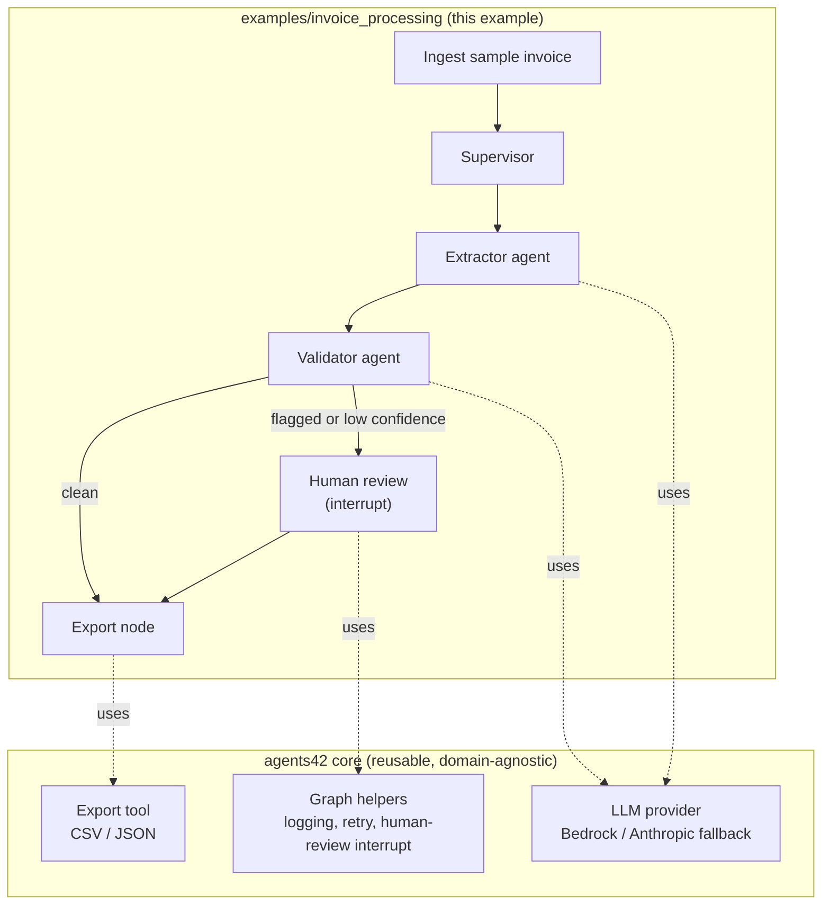

# agents42: Reusable Agentic AI Starter Kit + Invoice Processing Example

Date: 2026-08-15
Status: Approved (design), not yet implemented



## Context

This repo (`agents42`) is the team's project for the **NUS-ISS Show Me Your
Agents Hackathon** (powered by AWS). The team is registered under the
**Public Category** (teams of exactly 4), which means the *actual* SME
business problem statement is not chosen by the team — it is assigned at
the **Hackathon Kickoff on Saturday, 5 September 2026**, from a set of
official SME problem statements curated by the organizers.

Key dates:
- Registration closes: Wed, 26 Aug 2026
- Kickoff (real problem statement revealed, attendance mandatory): Sat, 5
  Sep 2026
- Build Phase: Mon 7 Sep – Fri 25 Sep 2026
- Final submission: Mon, 28 Sep 2026
- Finale Demo Day: Sat, 10 Oct 2026

Because the real problem isn't known yet, and AWS cloud credits are only
guaranteed during the Build Phase, this spec covers work that can start
today: a **reusable agent architecture** the team can quickly re-point at
whatever problem is revealed at kickoff, proven out today against a
**concrete, representative example** — an invoice/receipt processing agent
for the "Administrative Automation" category — so the pattern is tested,
not just theoretical.

## Goals

1. A reusable "starter kit" core (LLM provider abstraction, generic
   LangGraph building blocks, config, export tooling) that is not tied to
   the invoice-processing domain.
2. A working example application built on that core — an invoice/receipt
   processing agent — that runs end-to-end today with sample data and no
   external accounts required.
3. An architecture that scores well against the hackathon's stated
   judging themes: practical & relevant, feasible to pilot, secure &
   responsible, sound technical architecture, effective use of agentic
   AI, measurable business impact.
4. A documented path for swapping in the real SME problem after the Sep 5
   kickoff without restructuring the core.

## Non-Goals (explicitly out of scope for this spec)

- Real OCR/PDF/image parsing of invoices (sample data is plain text
  standing in for OCR'd output; swapping in real document parsing, e.g.
  Bedrock Claude multimodal vision, is called out as a follow-up
  extension point, not built now).
- Real external integrations (email inbox, Google Drive, accounting
  software APIs). The demo is self-contained against local sample files.
- Deployment/infrastructure-as-code for AWS (SAM/CDK, hosting). Out of
  scope until the team has real AWS credits and a real problem to deploy
  against.
- Multi-tenant / production auth, persistence beyond local files.

## Architecture Overview

The repo is split into two layers:

```
agents42/
  src/agents42/            # reusable starter-kit core (domain-agnostic)
    llm/provider.py        # LLM provider abstraction (Bedrock / fallback)
    graph/state.py          # base LangGraph state types
    graph/builder.py         # reusable graph helpers: logging node,
                              # retry wrapper, human-review interrupt node
    tools/export.py          # generic structured-record -> CSV/JSON export
    config.py                # pydantic-settings based config loader
  examples/
    invoice_processing/      # concrete example app, built on the core
      schema.py              # ExtractedInvoice, LineItem (Pydantic)
      agents.py               # Supervisor / Extractor / Validator agent defs
      graph.py                 # LangGraph graph wiring the agents together
      prompts.py                # prompt templates for Extractor/Validator
      run_cli.py                 # CLI: run the graph over data/samples/
      app_streamlit.py            # Streamlit demo UI
  data/samples/               # hand-crafted sample "invoices" (plain text)
  tests/                       # pytest: schema + deterministic validation
  docs/                        # this spec, and future ones
```

**Why this split matters:** when the real SME problem is revealed at
kickoff, the team creates a new `examples/<new-problem>/` app (new
schema, new agents, new prompts) that reuses the same core — LLM
provider setup, graph helpers, config, and export tooling do not need to
be rewritten. This is the reusability story for judging, and it also
means the team isn't starting from zero on kickoff day.

## Agent Design (Multi-Agent Supervisor Pattern)

Chosen over a simple linear pipeline and over a free-form ReAct agent
(see trade-off discussion below) because it is genuinely agentic
(multiple specialized agents, autonomous routing, tool use), reasonably
predictable for a live judged demo (LangGraph's explicit graph gives
control over what can happen), and directly reusable as a pattern for a
different SME domain later.

Flow for the invoice-processing example:

1. **Ingest**: load a sample invoice (plain text file standing in for
   OCR'd output) into graph state.
2. **Supervisor**: routes the document; on the first pass always routes
   to Extractor, then to Validator once extraction succeeds.
3. **Extractor agent** (LLM call): reads the raw text and produces a
   structured `ExtractedInvoice` (vendor, date, line items, subtotal,
   tax, total), validated against a Pydantic schema so malformed LLM
   output fails fast and can be retried.
4. **Validator agent**: applies deterministic checks (line items sum to
   subtotal, subtotal + tax = total, required fields present, invoice
   number not already seen in this run) plus an LLM judgment call for
   fuzzier anomalies (e.g. vendor name looks suspicious, amount is an
   outlier). Produces a confidence score and a list of flags.
5. **Human-review interrupt**: if Validator raises any flag or
   confidence is below a threshold, the graph pauses (LangGraph
   interrupt) and surfaces the record for human approve/correct in the
   UI, before continuing. This is the "secure & responsible design"
   story — the agent doesn't silently auto-approve anomalies.
6. **Export**: writes the (approved) structured record to a CSV/JSON
   "accounting-ready" output file.

State schema (`graph/state.py` base + example-specific extension) is a
TypedDict/Pydantic model carrying: input document, extraction result,
validation result, flags, human decision, and a running trace log (list
of `{agent, action, output}` entries) used to drive the UI's
step-by-step trace view.

## LLM Provider Abstraction

`llm/provider.py` exposes a single `get_llm()` used by all agents.
Backing provider is selected by env var:

- `LLM_PROVIDER=bedrock` (default when AWS credentials are present) —
  AWS Bedrock, Claude model, via `langchain-aws`. This is the primary
  path and the one that matters for the hackathon's AWS-powered framing.
- `LLM_PROVIDER=anthropic` — direct Anthropic API key, for local
  development before the team has hackathon AWS credits (registration
  closes 26 Aug, kickoff isn't until 5 Sep — there's a real gap where
  Bedrock access may not exist yet).

Model choice, region, and temperature are read from `.env` via
`config.py` (pydantic-settings). `.env.example` documents required
variables without committing secrets.

## Demo UI

A single-page Streamlit app (`examples/invoice_processing/app_streamlit.py`):
pick a sample invoice from a dropdown, run the graph, watch a live
step-by-step trace (which agent ran, what it produced), see the final
structured JSON, approve/correct any flagged anomaly, and download the
exported CSV/JSON. Streamlit is chosen for speed (pure Python, no
separate frontend build) given the team's limited build time and the
Python-first stack decision.

## Sample Data

5–8 hand-crafted plain-text files in `data/samples/`, a mix of clean
invoices and deliberately anomalous ones (bad math, missing vendor,
duplicate invoice number) so the Validator agent and human-review path
both have something real to demonstrate.

## Testing Strategy

`pytest` covers what's deterministic and worth pinning down:
- `ExtractedInvoice`/`LineItem` Pydantic schema validation (rejects
  malformed data).
- Validator's deterministic rules (math check, required-fields check,
  duplicate-invoice-number check) against fixture data.

LLM output itself is not unit-tested (nondeterministic); the code is
structured so a team member can add LLM-output eval tests later if
desired (out of scope for this pass).

## Extensibility Story (for kickoff day)

To point this starter kit at the real SME problem after 5 Sep 2026:
1. Create `examples/<new-problem>/` with its own `schema.py`,
   `agents.py`, `graph.py`, `prompts.py`.
2. Reuse `agents42.llm.provider.get_llm()`, the graph helpers in
   `agents42.graph.builder` (logging node, retry wrapper, human-review
   interrupt node), and `agents42.tools.export` as-is.
3. Swap the Streamlit UI's data source and trace rendering to the new
   domain (the trace-log shape in base state is domain-agnostic).

This is the core reusability bet of building the starter kit now instead
of waiting for kickoff.

## Candidate Problem Patterns (Pre-Kickoff Brainstorm)

Ahead of the 5 Sep kickoff, the team ran a broader brainstorm across many SME
verticals (see `docs/2026-08-27-sme-problem-brainstorm.md`) to pressure-test this
shape against problems outside invoice processing. Three of the four problems
explored in depth — appointment rescheduling, medication refill/collection, and
retail stocktaking — map cleanly onto the same intake -> extract -> validate ->
human-review -> export/act shape used here. One, supporting people with hoarding
behaviour, does not: it's closer to a stateful decision-support conversation than a
single-record pipeline, which is exactly the case the Open Risks section below
already anticipated. Treat that catalog as reference material for quickly
classifying whichever real problem is assigned at kickoff, not as a design
commitment.

## Open Risks / Follow-ups (not blocking this spec)

- Real AWS Bedrock model access/region availability isn't confirmed yet
  for the team — `LLM_PROVIDER=anthropic` fallback exists specifically
  to de-risk this.
- If the real SME problem at kickoff doesn't fit the
  extraction-validation-export shape at all (e.g. it's a conversational
  customer-service problem), the Supervisor/specialist-agent *pattern*
  still applies, but the specific Extractor/Validator agents will be
  replaced wholesale — expected and fine, that's what the split is for.
